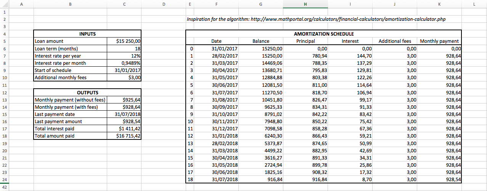
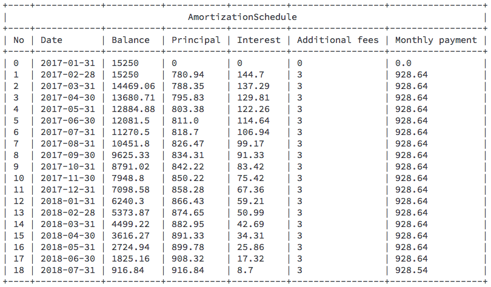

# PaymentSchedule

[](https://travis-ci.org/murdho/payment_schedule)
[](https://lima.codeclimate.com/github/murdho/payment_schedule)
[](https://lima.codeclimate.com/github/murdho/payment_schedule/coverage)

PaymentSchedule is a Ruby gem for describing and calculating payment schedules. Its goal is to make implementation and modification of payment schedule algorithms fast and easy to understand.

Requires Ruby 2.4.0 or higher.


## Introduction

#### Easy to use

Simple to keep the algorithm similar to payment schedule's tabular nature. This enables faster changes in the code when the specification changes. At the same time code is clear and readable, even for a person who hasn't got much experience with such algorithms.


#### Fast

It has good memory and is very lazy — that's why it calculates as little as needed and is very fast.


## Example

Take a look at the example, which demostrates the simplicity of the gem.


#### Example specification (spreadsheet)

Algorithm implemented using a spreadsheet software: [amortization_schedule.xlsx](examples/amortization_schedule.xlsx)

Screenshot:

<p align="center">
  
</p>


#### Example implementation in Ruby

Algorithm implementation in Ruby, based on the spreadsheet: [amortization_schedule.rb](examples/amortization_schedule.rb)

Screenshot:

<p align="center">
  
</p>


## Getting Started

1. Add this line to your application's Gemfile:

   ```ruby
   gem 'payment_schedule'
   ```

2. In project directory, execute:

   ```shell
   bundle
   ```

3. Create a class which describes the algorithm:

   ```ruby
   # Description of My Awesome Payment Schedule algorithm.
   # References spreadsheet examples/amortization_schedule.xlsx

   MyAwesomeSchedule = PaymentSchedule.new do
     require_input(
       :loan_amount,        # Cell: C5
       :loan_term,          # Cell: C6
       :interest_rate_year  # Cell: C7
     )

     # Cell: C8
     helper(:interest_rate_month) do
       (1 + self[:interest_rate_year]) ** (1 / 12) - 1
     end

     # Column: I
     component(:interest) do
       # Cell: I6
       row(0) { 0 }

       default do |n|
         self[:interest_rate_month] * self[:balance, n]
       end
     end

     # Column: G
     component(:balance) do
       # Cells: G6-G7
       row(0..1) { self[:loan_amount] }

       default do |n|
         self[:balance, n - 1] - self[:principal, n - 1]
       end
     end
   end
   ```

4. Try it out in REPL:

   ```ruby
   schedule = MyAwesomeSchedule.new(
     loan_amount: 1000,
     loan_term: 12,
     interest_rate_year: 0.1
   )

   schedule[:balance, 12]
   # => 86.95

   schedule[:interest_rate_month]
   # => 0.7974
   ```

5. Plug it in to your app

6. Share it with customers

7. Profit! :sunglasses:


## Contributing

Bug reports and pull requests are welcome on GitHub at https://github.com/Murdho/payment_schedule. This project is intended to be a safe, welcoming space for collaboration, and contributors are expected to adhere to the [Contributor Covenant](http://contributor-covenant.org) code of conduct.


## License

The gem is available as open source under the terms of the [MIT License](http://opensource.org/licenses/MIT).

